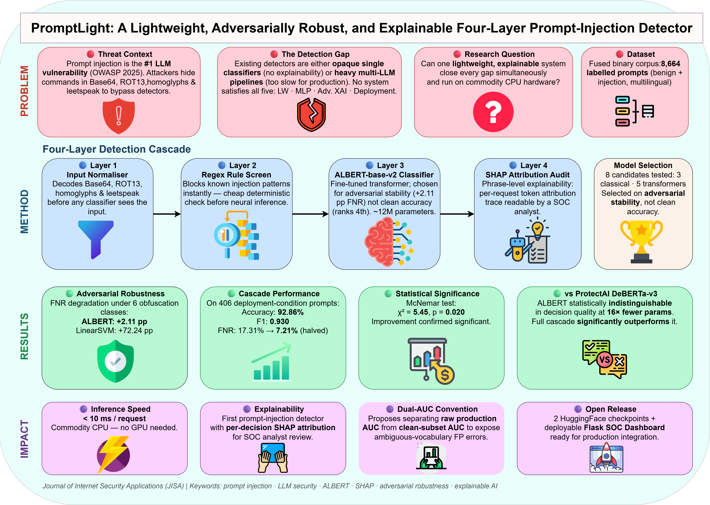

# PromptLight: A Lightweight, Adversarially Robust, and Explainable Four-Layer Prompt-Injection Detector

[](https://opensource.org/licenses/MIT)
[](https://www.python.org/downloads/)

## Visual Abstract
 
*(Replace the path above with the actual path to your visual abstract image in the repo)*

## Abstract
Prompt injection now tops the OWASP vulnerability list for LLM-integrated applications, yet most defences are either opaque single classifiers or multistage pipelines too heavy for real-time use. We present **PromptLight**, a four-layer cascade—input normaliser, regex screen, fine-tuned ALBERT classifier, and phrase-level SHAP audit—built for live CPU deployment. 

On 406 deployment-condition prompts, the cascade reaches 92.86% accuracy and F1 = 0.930, cutting the false-negative rate from 17.31% to 7.21%. Head-to-head against ProtectAI DeBERTa-v3, our fine-tuned ALBERT is statistically indistinguishable in decision quality at 16× fewer parameters. The complete pipeline runs under 10ms per request on commodity hardware.

## Key Highlights
* **Robust Benchmark:** Eight-model lightweight benchmark with paired adversarial-robustness evaluation across six obfuscation classes.
* **Adversarial Stability:** ALBERT-base-v2 selected based on adversarial robustness (+2.11 pp FNR delta) rather than clean accuracy.
* **Four-Layer Cascade:** Efficient sequential architecture (L0 Normalizer $\to$ L1 Regex $\to$ L2 ALBERT $\to$ L3 SHAP).
* **Statistical Rigor:** Significant improvement confirmed via McNemar test ($\chi^2 = 5.45, p = 0.020$).
* **Dual-AUC Convention:** New reporting method to isolate ambiguous-vocabulary false positives.
* **Production Ready:** Released as two HuggingFace checkpoints and a deployable Flask SOC dashboard.

## Methodology Overview
PromptLight chains four layers to balance security and performance:
1. **L0 Input Normalizer:** Decodes Base64, ROT13, homoglyphs, and leetspeak.
2. **L1 Regex Screen:** Cheap, deterministic blocklist for known injection patterns.
3. **L2 ALBERT-base-v2:** Fine-tuned transformer for robust semantic detection.
4. **L3 SHAP Audit:** Token-level attribution trace for explainable security decisions.

## Citation
If you use this research or code in your work, please cite:
```bibtex
@article{hosen2026promptlight,
  title={PromptLight: A Lightweight, Adversarially Robust, and Explainable Four-Layer Prompt-Injection Detector},
  author={Hosen, Showkot and Hossain, Md. Farhad and Hossain, Md. Azad},
  journal={Journal of Information Security and Applications (JISA)},
  year={2026}
}
